```{r setup, include=FALSE}
knitr::opts_chunk$set(echo = TRUE)
knitr::opts_chunk$set(tidy = TRUE)
knitr::opts_chunk$set(warning = FALSE)

libs <- c("tidyverse", "knitr", "kableExtra", "fpp2", "glue")

loadPkg <- function(x) {
  if(!require(x, character.only = T)) install.packages(x, dependencies = T)
  require(x, character.only = T)
}

lapply(libs, loadPkg)
```

## HW1

### 2.3


#### a
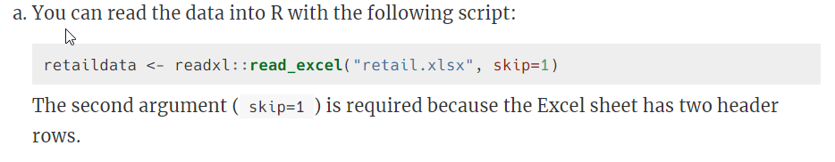

```{r}
retailData <-  readxl::read_excel('./week1/retail.xlsx', skip=1)
```


#### b


```{r}
myts <- ts(retailData[, "A3349338X"],
           frequency = 12,
           start=c(1982,4))
```


#### c


```{r}
autoplot(myts[, "A3349338X"]) +
  ggtitle("Time Series Plot A3349338X") +
  xlab("Year") +
  ylab("Value")
```

From the time series plot, we able to deduce:
* Trend: there is a clear upward trend over the duration of the time series

```{r}
ggseasonplot(myts, year.labels = T) +
  ggtitle("Seasonal plot: A3349338X")

ggsubseriesplot(myts) +
  ggtitle("Seasonal subseries pllot: A3349338X")
```

From the seasonal plot,  we are able to deduce:
* Seasonality: there is some clear seasonality that exists among different month, however it is not without minor variation/deviation between the years
* December shows a clear uptick while February shows a clear downtick

```{r}
ggAcf(myts)
```

From the Acf plot, we are able to confirm:
* Trend: the autocorrelations are slowly decreasing as the lags are increasing

Conclusion:
* Trend exists in this time series and is slowly going upwrd
* Seasonality appears to exist however there are years that defy seasonality patterns
* There does not appear to be any cyclic behavior

### 2.7


```{r}
arrivals <- data("arrivals")
```

```{r}
autoplot(arrivals) +
  ggtitle("Arrivals Time Series") +
  facet_wrap(~series)
```

Observations:
* Japan seems to experience a an upward trend, reach an apex, and then experience a downward trend
* NZ, UK, and US all experience upward trends in arrivals albeit to different degrees
* UK appears to have the greatest variance in their arrival figures
* US has very little deviation in their arrival trend
* NZ has more fluctuation than US, but less than UK in their arrivals
* US on average has the lowest amount of arrivals

```{r}
genSeasonPlot <- function(country) {
  ggseasonplot(arrivals[, country]) +
    ggtitle(glue("Season Plot: {country}"))
}

countries <- c("Japan", "NZ", "US", "UK")
countries %>%
  map(~ genSeasonPlot(.x))
```

Observations from Seasonal Plots:
* Typically the countries will see their highest arrivals in Q3, however the UK appears to go against this seasonal pattern
* Q2 appears to be a down quarter for all countries except NZ
* Q1 is a low point for NZ, and generally a high point for the other countries

```{r}
genSubSeasonPlot <- function(country) {
  ggsubseriesplot(arrivals[, country]) +
    ggtitle(glue("Subseries Plot: {country}"))
}

countries %>%
  map(~ genSubSeasonPlot(.x))
```

Observations:
* Japan's mean stays relatively flat across the quarters outside of Q2
* US also remains relatively consistent and further backs up the lack of deviation point made earlier
* UK experiences the most arrivals in Q1 and A4


### 2.10
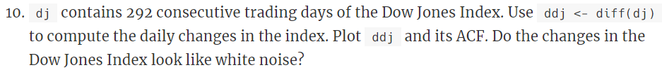

```{r}
data("dj")
ddj <- diff(dj)
```

```{r}
autoplot(ddj)
```

The autoplot appears to show random variation with peaks and valleys 


```{r}
ggAcf(ddj)
```

The changes in the Dow Jones Index do appear to be white noise as the the autocorrelations are very close to zero

### 3.1


#### usnetelec
```{r}
data("usnetelec")
lambda <- BoxCox.lambda(usnetelec) %>%
  print()

autoplot(BoxCox(usnetelec, lambda))
```


#### usgdp
```{r}
data("usgdp")

lambda <- BoxCox.lambda(usgdp) %>%
  print()

autoplot(BoxCox(usgdp, lambda))
```


#### mcopper
```{r}
data("mcopper")

lambda <- BoxCox.lambda(mcopper) %>%
  print()

autoplot(BoxCox(mcopper, lambda))
```


#### enplanements
```{r}
data("enplanements")

lambda <- BoxCox.lambda(enplanements) %>%
  print()

autoplot(BoxCox(enplanements, lambda))
```


### 3.8
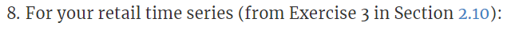

#### a


```{r}
myts.train <- window(myts, end=c(2010,12))
myts.test <- window(myts, start=2011)
```

#### b
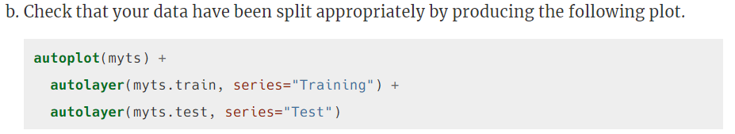

```{r}
autoplot(myts) +
  autolayer(myts.train, series="Training") +
  autolayer(myts.test, series="Test")
```

The autoplot shows that the data has been correctly split with the latter part of the data reservered for testing

#### c


```{r}
fc <- snaive(myts.train)

print(fc)
```

#### d
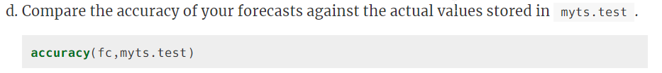

```{r}
accuracy(fc, myts.test)
```

Conclusions:
* The MASE shows that the seasonal naive method does produce a better forecast than the average naive forecast although very slightly. The MASE is only .95
* The MAPE shows that there is about a 9% error in the forecast on average which is not bad, but does show tht it could be improved
* The RMSE and MAE both show that it is possible to improve the forecast but the seasonal naive forecast does do a decent job

#### e


```{r}
checkresiduals(fc)
```

The residual diagnostics show:
* An approximately normal distribution
* The mean of the residuals is close to 0
* The residual variance appears to be contant
* The residuals appear to be correlated as the lags near to each other are similar in direction and size
* Although the residuals pass the diagnostic tests, it does still show that the prediction intervals may be inaccurate
* The Box-Ljung test does show a very small p-value which means the residuals are distinguishable from a white noise series. The Q* value is also very large

#### f


Accuracy measures are very sensitive to the training/test split. Forecasts by definition need historical data. The more information present to forecast on, the better the forecast


## HW2


### 6.2


#### a
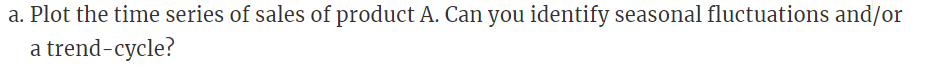


```{r, include=TRUE}
autoplot(plastics) + xlab("Month") + ylab("1000 $") +
  ggtitle("Monthly Plastic Sales")
```

The data has approximately 1 month (peak to peak) seasonality and an apprearent upward trend, that may be cyclic behavior since this only covers 6 months of data.


#### b


```{r}
plastics
autoplot(plastics)
plas_trend <- ma(plastics, order = 12, centre = TRUE)
plas_trend
autoplot(plas_trend)
plas_detrend <- plastics/plas_trend
plas_detrend
plas_seas <- colMeans(t(matrix(plas_detrend,nrow = 12)), na.rm = TRUE)
plas_seas
autoplot(as.ts(plas_seas))
random_plas = plastics/ (plas_trend* plas_seas)
(random_plas)
random_plas
```

```{r}
plastics %>% decompose(type="multiplicative") %>%
  autoplot() + xlab("Month") +
  ggtitle("Classical multiplicative decomposition
    of Plastic Sales")
```

```{r}
plastics %>% decompose(type="multiplicative")
```


#### c


Yes the trend is sloped upward and the seasonal trend reaches maximum once a month.


#### d
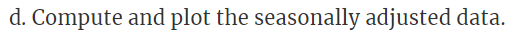

```{r}
plas_seas <- decompose(plastics, type = 'multiplicative')$seasonal
plas_seas
plas_seas_adj = plastics/plas_seas
autoplot(plas_seas_adj)
```


#### e


```{r}
plastics[30]
new_val <- plastics[30]+500
plas_outlier <- replace(plastics,30, new_val)
plas_outlier[30]
plas_seas_outlier <- decompose(plas_outlier, type = 'multiplicative')$seasonal
plas_seas_outlier
plas_seas_adj_outlier = plas_outlier/plas_seas_outlier
autoplot(plas_seas_adj_outlier)
```

It adds a spike to the seasonally adjusted data where the outlier is.


#### f
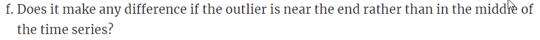

```{r}
plastics[5]
new_val <- plastics[5]+500
plas_outlier <- replace(plastics,5, new_val)
plas_outlier[5]
plas_seas_outlier <- decompose(plas_outlier, type = 'multiplicative')$seasonal
plas_seas_outlier
plas_seas_adj_outlier = plas_outlier/plas_seas_outlier
autoplot(plas_seas_adj_outlier)
```

```{r}
plastics[55]
new_val <- plastics[55]+500
plas_outlier <- replace(plastics,55, new_val)
plas_outlier[55]
plas_seas_outlier <- decompose(plas_outlier, type = 'multiplicative')$seasonal
plas_seas_outlier
plas_seas_adj_outlier = plas_outlier/plas_seas_outlier
autoplot(plas_seas_adj_outlier)
```

Yes, the spike occurs where the outlier is.


### 6.6
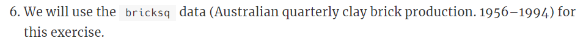


#### a
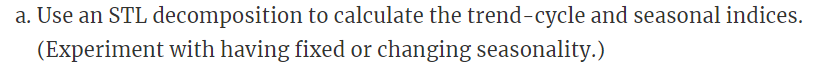

```{r, include=TRUE}
bricksq %>% autoplot()
bricksq %>%
  stl(t.window=13, s.window="periodic", robust=TRUE) %>%
  autoplot()
bricksq %>%
  stl(t.window=13, s.window=7, robust=TRUE) %>%
  autoplot()
bricksq %>%
  stl(t.window=13, s.window=25, robust=TRUE) %>%
  autoplot()
bricksq %>%
  stl(t.window=13, s.window=81, robust=TRUE) %>%
  autoplot()
```

We see that a high s.window yeilds the same as periodic.

```{r, include=TRUE}
bricksq %>% autoplot()
bricksq %>%
  stl(t.window=13, s.window="periodic", robust=TRUE) %>%
  autoplot()
bricksq %>%
  stl(t.window=25, s.window="periodic", robust=TRUE) %>%
  autoplot()
bricksq %>%
  stl(t.window=7, s.window="periodic", robust=TRUE) %>%
  autoplot()
bricksq %>%
  stl(t.window=3, s.window="periodic", robust=TRUE) %>%
  autoplot()
```

The t.window parameter adjusts the goodness of fit of the trend, low values tend to under fit the trend, and high values tend to over fit the trend.


#### b
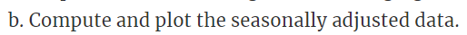


```{r, include=TRUE}
brick_seas <- decompose(bricksq, type = 'multiplicative')$seasonal
brick_seas
brick_seas_adj = bricksq/brick_seas
autoplot(brick_seas_adj)
```


#### c


```{r, include=TRUE}
brick_naive <- naive(brick_seas_adj, h=12)
brick_naive
autoplot(brick_seas_adj) +
  autolayer(brick_naive,
    series="Naïve", PI=TRUE)
```


#### d
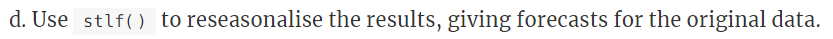

```{r, include=TRUE}
fcast <- stlf(brick_seas_adj, method='naive')
autoplot(fcast)
```


#### e


```{r, include=TRUE}
res_brk <- residuals(brick_naive)
autoplot(res_brk)
gghistogram(res_brk) + ggtitle("Histogram of residuals")
ggAcf(res_brk) + ggtitle("ACF of residuals")
res_fcast <- residuals(fcast)
autoplot(res_fcast)
gghistogram(res_brk) + ggtitle("Histogram of residuals")
```

They seem to increse as time increases, so no they do not look uncorrelated. Also a couple of the lags show significance, that may or may not be by chance.


#### f


```{r, include=TRUE}
brick_stl <- brick_seas_adj %>% stlf(t.window=7, s.window="periodic", method = 'naive', robust=TRUE) 
brick_stl %>% autoplot()
```

In this instance, it the residuals appear to behave similarly to a STL decompostion that is not robust.

```{r}
res_brk2 <- brick_stl %>% residuals()
res_brk2 %>% autoplot()
gghistogram(res_brk2) + ggtitle("Histogram of residuals")
ggAcf(res_brk2) + ggtitle("ACF of residuals")
```


#### g
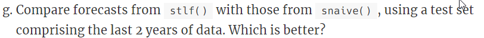

```{r}
train <- bricksq %>% window(1956, c(1992, 3))
test <- bricksq %>% window(c(1992, 4), c(1994, 4))
train_stlf <- train %>% stlf(method='naive', h=8)
train_snaiv <- train %>% snaive(h=8)
autoplot(bricksq) +
  autolayer(train_stlf, series="STL", PI=FALSE) +
  autolayer(train_snaiv, series="Seasonal naïve", PI=FALSE) +
  xlab("Quarter") + ylab("Bricks") +
  ggtitle("Forecasts for quarterly brick production") +
  guides(colour=guide_legend(title="Forecast"))
```

From the graphs, it is hard to tell.

```{r}
accuracy(train_snaiv, test)
accuracy(train_stlf, test)
```

From the accuracy fucnction, it appears that the STL decomposition performs better by yeilding less error in ME, RMSE, MAE, MPE, MAPE, and MASE.


### 3.1
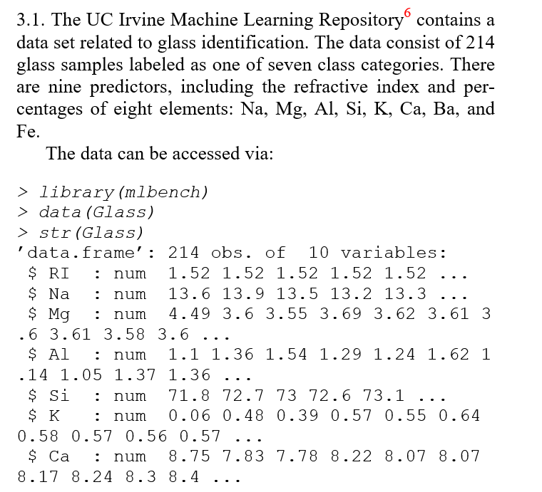


#### 3.1a
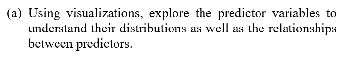


#### 3.1b
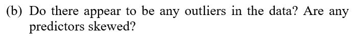


#### 3.1c
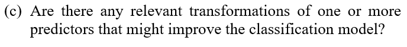


### 3.2
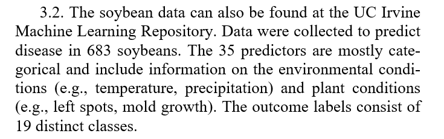

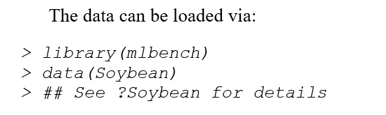


#### 3.2a
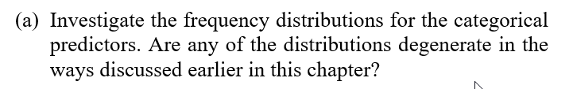


#### 3.2b
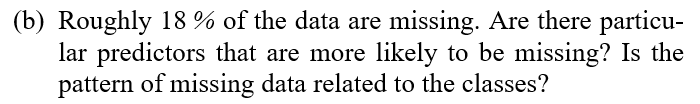


#### 3.2c


